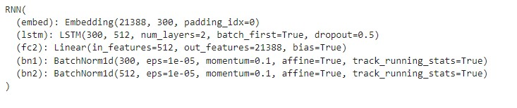
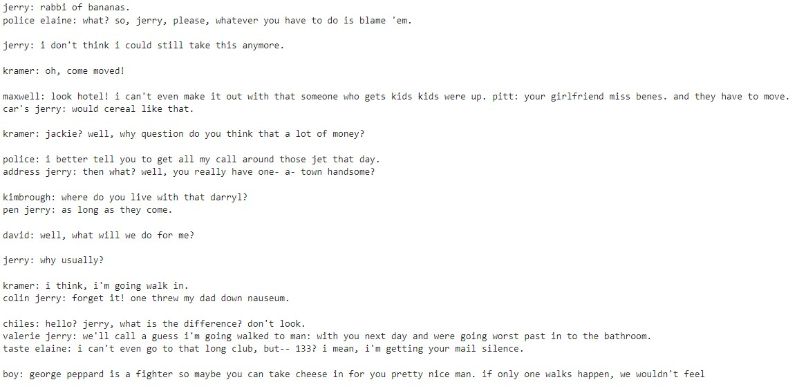

# Project: TV Script Generation
***
## 1. Introduction
Deep learning has provided a very flexible array of machine learning models
and architectures that let us achieve a very wide variety of tasks, from 
computer vision, to stock market data forecasting.

One very interesting application of this AI models is to generate new data, 
based on previously seen data. For this project, I used the sripts for 9 
seasons of ***Seinfeld***, a very popular American TV show. I trained an RNN
to predict the next word, following a sequence of text data.

## 2. Data and Model
The data used is stored in the `Seinfeld_Scripts.txt` file, in the `data`
folder. This folder contains the scripts for 9 seasons of the show. I divided
this text file into words to create my `vocabulary`, adding some puntuation
and padding tokens

With the numerical representation of the words in the vocabulary, I created
a `TensorDataset`, where I pass through the text, using the next word after a
sequence of script as my target variable.

With this dataset, transformed to a `DataLoader` object to ease the batching 
process, I used `PyTorch` to create an embedding and a **recurrent
neural network** (RNN) that process it. The task of the RNN is to predict the
next word after a sequence of script text. I used `nn.Embedding` and `nn.LSTM` 
cells from `PyTorch`.

The structure of the RNN is the following:

## 3. Results 
A sample of the generated text, created with the trained RNN, can be found in
the `generated_script_2.txt` file. Below you can see a small sample:

## 4. Tools and Software Used:
Most of the project is composed of two files:
1. A jupyter notebook called `dlnd_tv_script_generation.ipynb` developed in 
JupyterLab (v.3.0.11), where the body and explanation of the project is 
presented.
2. `helper.py`, which contains helper functions for the data processing and 
the storage of information (this was developed by Udacity's course).
3. `trained_rnn1.pt`, where the weights of the best model where stored.
4. `dlnd_tv_script_generation.html`, where the Jupyter notebook was stored as
a HTML file.

I also used Google Colab to train the RNN, taking advantage of the GPU service 
it provides.

The principal libraries used are:
+ [PyTorch](https://pytorch.org/docs/stable/nn.html#recurrent-layers): v. 1.9.1
+ [Collections](https://docs.python.org/3/library/collections.html): v.1.1.3
+ [Numpy](https://numpy.org): v.1.19.2

## 4. License

This software is licensed under the [MIT](https://opensource.org/licenses/MIT) 
license. The license can be found in the `license.txt` file. 
***

## 5. Acknoledgements

This project was done as part of the [Udacity](udacity.com) Deep Learning 
Nano Degree.

